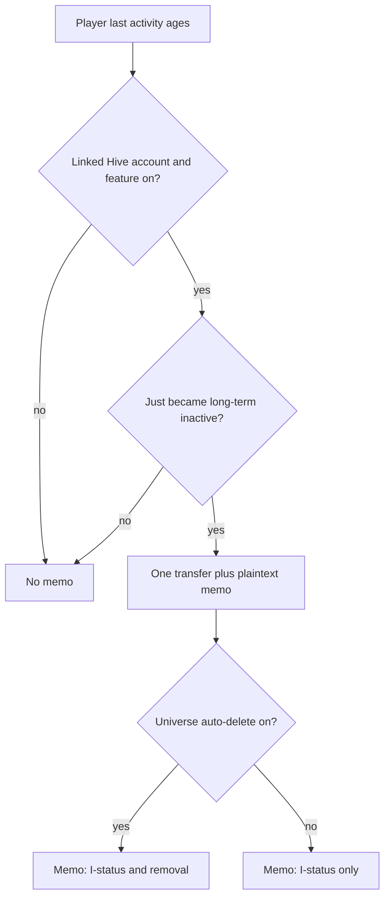

# Hive memo when a linked player goes long-term inactive

## Summary

When a player with a linked Hive account becomes long-term inactive, and the server-wide inactive-memo setting is on, the game sends one plaintext wallet memo on a transfer from the configured game account. The memo says they are now long-term inactive `(I)`. If that universe auto-deletes inactive empires, it also says the account will be removed. A later login resets the clock; the next lapse sends again.

## Problem Frame

Production does not send mail. SMTP is not configured, so the existing 21-day inactive email never goes out. Today a player can sit silent until the galaxy `(I)` flag, lose vacation protection, and be auto-deleted (default 90 days) with no off-site warning.

Hive-linked players still have an address they use: their Hive wallet. A transfer memo is the first notice those players can actually receive. Unlinked players still have no off-site address; this brief does not invent one.

This is win-back of people who already played and linked Hive, not acquisition of Hive users who never registered.

## Key Decisions

- **Fire at long-term inactive, not at a last-week wipe fuse.** The game already marks `(I)` at 60 days (`INACTIVE_LONG`). That is also when vacation protection drops. Default auto-delete is 90 days, so the memo is about 30 days before a default wipe.

- **Always name the `(I)` status. Name deletion only when that universe wipes.** Universes with auto-delete off still get the status memo. Universes with auto-delete on add a removal warning.

- **One personal plaintext memo per lapse, on a real transfer.** Not encrypted (that stays with issue #240). Not an ally ping. Wallets already surface transfer memos.

- **Server-wide operator tap, not per-universe wallets.** One enable flag, one game account, one active key, one asset (HIVE or HBD), one amount. Default amount is 0.003 HIVE. Floor is 0.003 of the chosen asset.

- **Repeat on every new lapse.** A login clears the stretch. Hitting `(I)` again later sends again. Not a once-per-account flag.

- **Memo clock and wipe clock stay independent.** Operators who set auto-delete to 60 days or less accept a short or zero warning window. This brief does not pause wipes for people we cannot notify.

- **Linked accounts only.** Unlinked inactives stay silent. That is a v1 cut, not a defect.

## Actors

- A1. Inactive player with a linked Hive account
- A2. Game operator (admin settings)
- A3. Game-owned Hive account that pays the transfer

## Key Flows

- F1. First long-term inactive warning
  - **Trigger:** A1's last activity crosses the long-term inactive threshold while the feature is enabled.
  - **Actors:** A1, A3
  - **Steps:** Confirm a non-empty linked Hive account. Send one transfer of the configured asset and amount from A3 to A1, with a plaintext memo. Do not send again while they remain in this same inactive stretch.
  - **Outcome:** A1 sees a wallet memo. The game is unchanged if they ignore it.
  - **Covered by:** R1, R2, R6, R7, R8

- F2. Return, then lapse again
  - **Trigger:** A1 logs in (clock resets), later crosses long-term inactive again.
  - **Actors:** A1, A3
  - **Steps:** Treat the new stretch as a new warning. Send one more transfer+memo.
  - **Outcome:** Each lapse gets exactly one memo.
  - **Covered by:** R5

- F3. Operator disables the feature
  - **Trigger:** A2 turns the server-wide enable off, or the feature is not configured to send.
  - **Actors:** A2
  - **Steps:** No transfers. In-game inactivity and wipe behavior stay as they are today.
  - **Outcome:** Silence, same as production now.
  - **Covered by:** R9, R10, R12

- F4. Memo copy follows wipe policy
  - **Trigger:** F1 runs.
  - **Actors:** A1
  - **Steps:** Memo always states they are long-term inactive `(I)`. Add that the empire will be removed only when that universe's auto-delete is on.
  - **Outcome:** Copy matches the actual stake in that universe.
  - **Covered by:** R3

## Requirements

**Who and when**

- R1. Only players with a non-empty linked Hive account are eligible for an inactive memo.
- R2. A memo is due when the player first qualifies as long-term inactive for the current stretch, using the same 60-day `(I)` threshold the galaxy already uses.
- R3. The memo always states that the player is long-term inactive `(I)`. It states that the empire will be removed only when auto-delete is enabled for that player's universe.
- R4. Players who are not yet long-term inactive, including those only short-term inactive `(i)` or in vacation before `(I)`, do not get this memo.
- R5. A login ends the current stretch. The next time the player becomes long-term inactive, they are due another memo.

**Transfer**

- R6. Each due memo is delivered as a plaintext memo on a Hive transfer from the configured game account to the player's linked account.
- R7. The transfer uses the operator-configured asset (HIVE or HBD) and amount. Default is 0.003 HIVE. The amount must be at least 0.003 of the chosen asset.
- R8. At most one transfer is sent per inactive stretch. Remaining long-term inactive does not produce daily or weekly repeats.

**Operator settings**

- R9. Admin has server-wide settings: enable/disable, Hive account name, private active key, asset (HIVE or HBD), and transfer amount.
- R10. With enable off, or with account name / active key / amount missing or invalid, no transfer is attempted.
- R11. These settings are server-wide. They are not configured per universe.

**Safety**

- R12. A failed or skipped transfer must not interrupt gameplay, inactivity marking, or auto-delete. The feature fails open.
- R13. The active key is an operator secret. It must not appear in player-facing UI, public profiles, or client-side pages.

## Acceptance Examples

- AE1. Linked player hits `(I)`, feature on, wipe on
  - **Covers:** R1, R2, R3, R6, R7
  - **Given:** Feature enabled, funded game account, player has a linked Hive account, universe auto-delete on, player just crossed 60 days offline.
  - **When:** The inactive-memo check runs.
  - **Then:** Exactly one transfer of the configured amount goes to that Hive account. The memo names `(I)` and that the empire will be removed.

- AE2. Linked player hits `(I)`, wipe off
  - **Covers:** R3
  - **Given:** Same as AE1 except auto-delete is off for that universe.
  - **When:** The check runs.
  - **Then:** One transfer is sent. The memo names `(I)` and does not claim the account will be deleted.

- AE3. Unlinked player hits `(I)`
  - **Covers:** R1
  - **Given:** Feature enabled, player's Hive account is empty.
  - **When:** The check runs.
  - **Then:** No transfer.

- AE4. Feature disabled
  - **Covers:** R9, R10
  - **Given:** A linked player just hit `(I)`, enable is off.
  - **When:** The check runs.
  - **Then:** No transfer.

- AE5. Still `(I)` the next day
  - **Covers:** R8
  - **Given:** AE1 already sent for this stretch.
  - **When:** The check runs again while they have not logged in.
  - **Then:** No second transfer.

- AE6. Login then lapse again
  - **Covers:** R5
  - **Given:** AE1 already sent, player logs in, later goes 60 days offline again.
  - **When:** They become long-term inactive again.
  - **Then:** One new transfer is sent.

- AE7. Transfer fails
  - **Covers:** R12
  - **Given:** Due memo, but the chain send fails (key, funds, or node).
  - **When:** The check runs.
  - **Then:** The game session and inactivity/wipe path continue. No player-facing crash.

- AE8. Amount below floor
  - **Covers:** R7, R10
  - **Given:** Admin sets amount to 0.001 HIVE.
  - **When:** A memo becomes due.
  - **Then:** No transfer is sent until the amount is at least 0.003.

## Success Criteria

- A Hive-linked player who goes long-term inactive can see the warning in a normal Hive wallet without opening the game.
- Operators can turn the feature off, or change amount and asset, without a code change.
- Ignoring the memo does not change combat, galaxy flags, or wipe timing.
- Shipping this does not require standing up SMTP.

## Scope Boundaries

**Deferred for later**

- Encrypted memos on friend request or private message (GitHub issue #240)
- Restoring email / SMTP as an inactive warning
- Warning unlinked players
- Ally or buddy pings when a member hits `(I)`
- Per-universe wallets or amounts
- Using this memo to recruit Hive users who have never played

**Outside this brief**

- Changing how `(i)` / `(I)` are calculated
- Changing auto-delete timing or pausing wipes when a memo cannot be sent
- In-game live event firehose or other Hive-chain broadcasts

## Dependencies / Assumptions

- The game can already tell long-term inactive from `onlinetime` vs `INACTIVE_LONG` (60 days) and short-term inactive from `INACTIVE` (14 days).
- Players can link a Hive account at register or in settings. The game currently reads and verifies Hive accounts; it does not write to the chain.
- An unused inactive-email cron exists and is gated on mail being active. Production mail is off.
- Default `del_user_automatic` is 90 days. Default unused email reminder is 21 days.
- Operators will create and fund a game Hive account, and will accept storing its active key in admin settings.
- Hive wallets surface plaintext transfer memos. Recipients do not need to follow a game account.

## Outstanding Questions

**Deferred to Planning**

- How to detect "just became `(I)`" vs "has been `(I)` for weeks" without sending a backlog to every currently inactive linked account on first deploy.
- What to do after a failed send (retry later in the same stretch, or wait until the next lapse).
- How admin settings store and display the active key (write-only, masked, confirm-replace).
- Exact memo wording and translation keys.

## Sources / Research

- GitHub issue #240 describes encrypted Hive memos on friend request and PM. Adjacent attention pattern; not this feature.
- `includes/constants.php` — `INACTIVE` 14 days, `INACTIVE_LONG` 60 days.
- `includes/GeneralFunctions.php` — `isInactive`, `isLongtermInactive`; vacation is off once long-term inactive.
- `includes/classes/cronjob/InactiveMailCronjob.php` — unused email reminder after `del_user_sendmail` days, gated on `mail_active`.
- `install/install.sql` — `del_user_automatic` default 90, `del_user_sendmail` default 21, `hive_account` on users.
- `includes/classes/HiveUtil.php` — account validate / sign verify / about text only. No transfer broadcast in app code.
- `includes/pages/game/ShowSettingsPage.php` and `includes/pages/login/ShowRegisterPage.php` — Hive account link and register.
- `vendor/mahdiyari/hive-php` — library can broadcast a transfer with memo. App code does not call it today.
