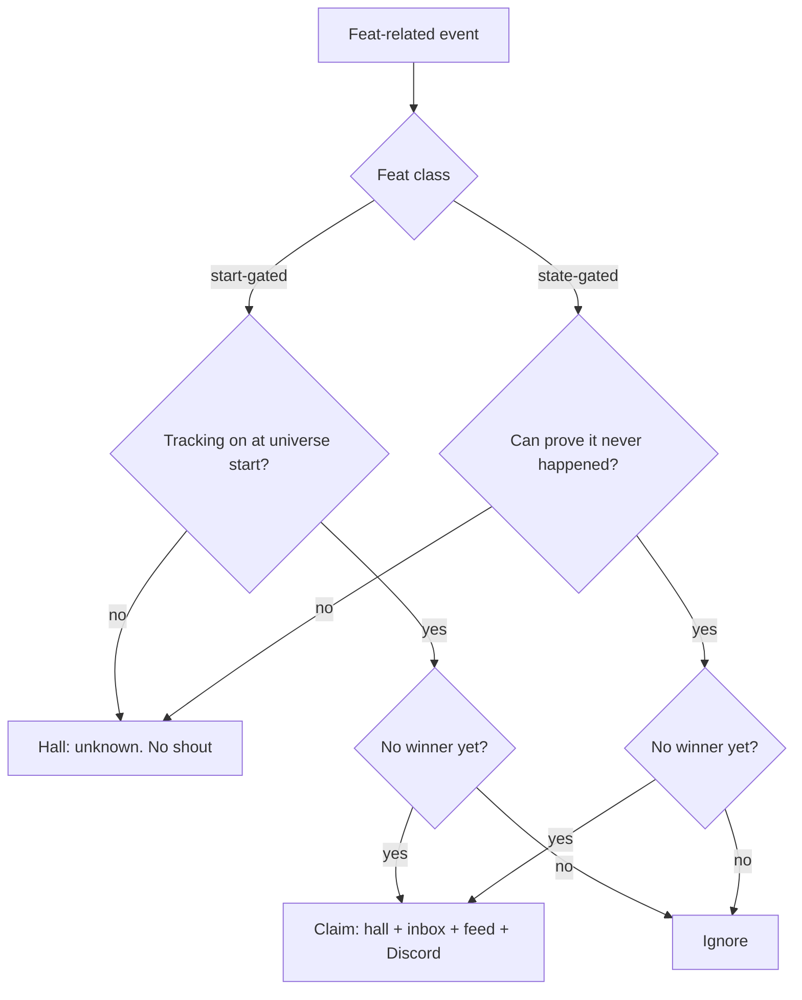

# Per-universe feats of strength

## Summary

Each universe keeps a hall of firsts — feats of strength — with at most one winner per feat. Claiming a feat shows an in-game banner, inboxes every player in that universe, posts the universe feed, and fires that universe's Discord webhook. Players find firsts as a new tab on the existing Hall of Fame page (same menu item as the top-100 battles), not as a new page and not on Achievements. There is no payout, title, badge, or achievement points.

## Problem Frame

Hardcore long-term players asked (Discord) for universe firsts they can point at. Today an operator notices the event and writes the news by hand. Misses happen. The shout disappears. Records only show who currently holds a max, not who did it first. Achievements are personal thresholds (including First Blood as *your* first win), not a single universe winner.

## Key Decisions

- **Timeline of firsts, not only late-game trophies.** Opening-day races (ship, colony) and later milestones (graviton, deathstar) both belong in v1 so a new universe has something to shout from day one.

- **Prestige only.** The feat is universe history. No resources, dark matter, titles, 🏅 badges, or achievement points. A gameplay bonus would snowball the leader.

- **Universe-unique achievements, HoF-only surface.** Unlock machinery is the achievement system so existing combat / colony / expedition / build hooks can fire firsts. Players do not hunt these on the Achievements page. Hall of Fame is the home.

- **No false firsts.** Do not crown whoever happens to act after we ship on a live universe. Opening-day firsts only race if tracking was on at universe start. Other firsts only race if we can prove they have not already happened. Otherwise the hall shows unknown. No historical backfill and no shout for unknown/old firsts.

- **Extend the existing Hall of Fame page.** Same in-game menu item as today's top-100 battles. Add a Feats of Strength tab on that page. No new nav entry, no new page, not Records, not the public login Battle Hall.

- **Shout on four channels.** In-game banner, inbox to every player in that universe, universe feed, and a new per-universe Discord webhook operators configure.

## Actors

- A1. Claiming player (hardcore / racing)
- A2. Other players in the same universe
- A3. Operator (configures the per-universe Discord webhook; no longer hand-writes these firsts)

## Requirements

**Catalog**

- R1. v1 feats, one winner per feat per universe: first ship, first colony, first expedition, first graviton, first hyperspace tech, first moon (own one), first to give a moon, first moon destruction, first deathstar, first to lose a deathstar in battle, first to defeat a deathstar, first raider to overcome defenses, first defender to repulse a fleet of over 100 ships, first to abandon a planet, first to abandon a homeworld.
- R2. First ship is the first *completed* shipyard unit in that universe, not the first queued job.
- R3. First graviton is the first player to unlock graviton tech. First hyperspace is the first player to unlock Hyperspace Technology.
- R4. First raider to overcome defenses is an attacker win against a planet that had defense. First defender to repulse 100+ ships is a defender win against an attacking fleet whose ship count is at least 100. Empty probes do not count as overcoming defenses. First to give a moon is the attacker whose combat forms a moon on someone else's planet.
- R5. Personal First Blood and other per-player achievements stay unchanged and separate from these firsts.

**Eligibility**

- R6. Start-gated / event-only feats only accept a winner if tracking was active at that universe's start. That set is: first ship, first colony, first expedition, give a moon, moon destruction, lose/defeat a deathstar, raid defenses, defend 100 ships, abandon planet, abandon homeworld. On a universe that was already running when this ships, they show as unknown.
- R7. State-gated feats only accept a winner if we can prove the feat has not already happened in that universe. If we cannot prove it, show unknown. Do not crown the next occurrence after launch as a substitute first.
- R8. On a live universe, graviton and hyperspace may still race when no player currently has that tech. First moon may still race when no moon exists. First deathstar, moon destruction, give-a-moon, and the combat/abandon firsts stay unknown unless tracking was on from universe start.
- R9. A new universe starts a fresh race for every feat. A claimed feat never reopens in that universe.
- R10. Each feat has at most one winner. If two completions collide, the earlier one wins. The loser is not announced as a co-winner.

**Hall**

- R11. The existing in-game Hall of Fame page gains a Feats of Strength tab. Same menu item as the battle hall. The tab lists each v1 feat for the current universe, its winner (or unknown), and the claim time when known. The battles list stays on the other tab.
- R12. Unknown means the first occurred before tracking, or cannot be proven never to have happened — not "still available." Available feats show as unclaimed until won.
- R13. These firsts do not appear on the personal Achievements page, do not grant achievement points, and do not grant rewards.

**Announcements**

- R14. On a valid claim, every player in that universe receives an in-game message naming the player, the feat, and the universe. The same claim sets an in-game overview banner for that universe.
- R15. The same claim posts to the in-game universe feed.
- R16. The same claim posts to that universe's Discord webhook when the webhook is configured. A missing webhook does not block the hall, banner, inbox, or feed.
- R17. Operators can set a Discord webhook URL per universe. There is no server-wide-only substitute for that URL.
- R18. Do not announce unknown feats, backfilled feats, or feats that fail eligibility.

## Key Flows

- F1. Claim on a new universe
  - **Trigger:** A1 completes a v1 feat that has no winner.
  - **Actors:** A1, A2, A3
  - **Steps:** Record A1 as the sole winner. Write the hall row. Set the overview banner. Inbox every player in the universe. Post the universe feed. If a webhook is set, post Discord.
  - **Outcome:** Hall shows A1 and the time. Later completions of the same feat do nothing.
  - **Covered by:** R1, R9, R10, R14, R15, R16, R18

- F2. Live universe, start-gated feat
  - **Trigger:** A player founds a colony (or builds a ship, sends/completes an expedition, wins a real fight) after this ships on an already-running universe.
  - **Actors:** A1, A2
  - **Steps:** Eligibility fails. No winner, no shout.
  - **Outcome:** Hall keeps first colony (and the other start-gated feats) as unknown.
  - **Covered by:** R6, R12, R18

- F3. Live universe, graviton still open
  - **Trigger:** A1 unlocks graviton and no player in that universe has graviton.
  - **Actors:** A1, A2
  - **Steps:** Same as F1 for graviton only.
  - **Outcome:** Hall lists A1. If anyone already had graviton, the hall would have shown unknown and this trigger would not claim.
  - **Covered by:** R3, R7, R8, R14

- F4. Browse the hall
  - **Trigger:** A2 opens Hall of Fame from the existing in-game menu.
  - **Actors:** A2
  - **Steps:** The page still shows the battle hall. Switching to the Feats of Strength tab shows this universe's firsts.
  - **Outcome:** All v1 feats are visible as won, unclaimed, or unknown. No extra menu item. Nothing is hidden on the personal Achievements page instead.
  - **Covered by:** R11, R12, R13

## Acceptance Examples

- AE1. Covers R6, R18.
  - **Given:** A live universe that started before this feature.
  - **When:** A player founds a colony.
  - **Then:** First colony stays unknown. No inbox, feed, or Discord post.

- AE2. Covers R3, R7, R8, R14.
  - **Given:** A live universe where no player has graviton tech.
  - **When:** A player unlocks graviton.
  - **Then:** That player is the winner. Every player in the universe is messaged. The hall shows them.

- AE3. Covers R7, R8, R12.
  - **Given:** A live universe where at least one player already has graviton, or a deathstar/moon-kill cannot be proven never to have happened.
  - **When:** Another player later unlocks graviton or builds a deathstar or destroys a moon.
  - **Then:** The feat stays unknown. No shout.

- AE4. Covers R4.
  - **Given:** A new universe with tracking on from start.
  - **When:** The first battle is a probe against a planet with no defense.
  - **Then:** First raider to overcome defenses is not claimed. A later win against a defended planet can still claim it.

- AE5. Covers R10, R18.
  - **Given:** First deathstar is unclaimed.
  - **When:** Two players complete a deathstar in the same moment.
  - **Then:** Only the earlier completion is the winner and is announced.

- AE6. Covers R13, R16.
  - **Given:** A feat is claimed and that universe has no Discord webhook.
  - **When:** The claim commits.
  - **Then:** Hall and inbox and feed still update. Discord is skipped. The winner gets no achievement points and no payout. The feat does not appear on Achievements.

## Success Criteria

- Operators stop hand-writing these firsts for universes where tracking is on.
- Hardcore players can open Hall of Fame months later and see who did what first in that universe.
- A live universe never announces a fake opening-day first after deploy.
- A new universe produces a short burst of real firsts (ship, colony, and the rest as they happen) on inbox, feed, and Discord when configured.

## Scope Boundaries

**Deferred for later**

- A chronicle of first-ever for every ship class, building, or tech
- Backfill of historical winners
- Public login-site listing
- Titles, badges, points, or gameplay rewards
- Extra feats beyond the catalog in R1

**Outside this product**

- Replacing Records (current maxes) or the top-100 battle hall
- Turning personal achievements into a first-to-X ladder

## Dependencies / Assumptions

- Combat, colonisation, expedition, and build-completion already notify the achievement system. Firsts should hang off those moments rather than a parallel detector where one already exists.
- The universe feed already exists (battle/moon events). Feat posts are additional events on that feed, not a new public news channel. Login news has no universe column and is the wrong place.
- Discord today is per-alliance combat alerts only. Per-universe feat webhooks are new operator config.
- Shipyard logs exist but record queue time, not completion. First ship must use completion, not that queue log alone.
- "Unknown" on a live universe is acceptable to the audience. Empty/omitted feats would hide the timeline.

## Outstanding Questions

**Deferred to planning**

- Exact inbound banner copy and how long it stays (replaced by the next feat is the default).
- First expedition: mission sent vs mission completed. Default: completed.
- Whether any existing log can prove no deathstar was ever built or no moon was ever destroyed in a live universe (R8). If none, those two stay unknown until a new universe.
- Copy for unknown vs unclaimed vs winner, and Discord/inbox wording.
- Tie-break when two completions share the same recorded timestamp (R10 says earlier wins; planning picks the clock).
- Whether the winner also gets a one-shot personal celebration overlay. Default no — prestige is the hall and the public shout.

## Sources

Adjacent systems (not first-to-X): current-max Records via `includes/classes/StatBuilder.php` and `includes/pages/game/ShowRecordsPage.php`; Hall of Fame top-100 battles via `includes/pages/game/ShowBattleHallPage.php` and public `includes/pages/login/ShowBattleHallPage.php`; per-user achievements via `includes/classes/AchievementService.php` and `includes/classes/AchievementHooks.php` (combat, colonisation, expedition, build completed); universe feed via `includes/classes/EventFirehoseWriter.php`; Discord combat webhooks via `includes/classes/DiscordWebhookService.php` (per-alliance URL, not per-universe). No existing one-winner-per-universe firsts table. Grounding quotes: `/tmp/compound-engineering/ce-brainstorm/feats-of-strength/grounding.md`.
