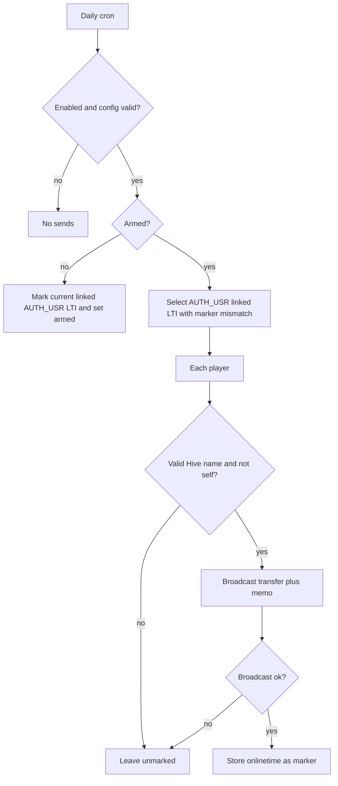
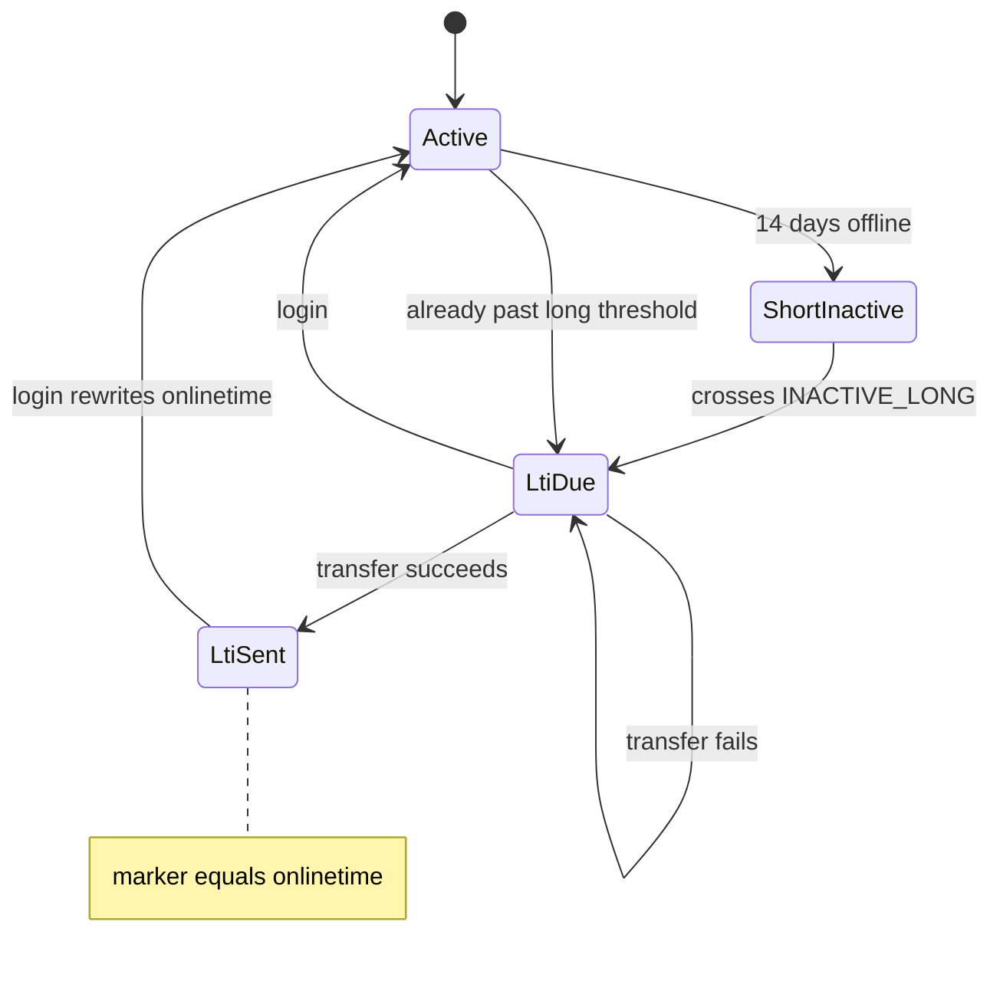

# feat: Hive memo when a linked player goes long-term inactive

## Summary

Add a server-wide Hive transfer+plaintext memo when a linked player first becomes long-term inactive `(I)`. Operators configure enable, account, active key, asset, and amount in admin. The first send-capable cron run after enable grandfathers whoever is already `(I)` so that moment is not a mass payout.

## Problem Frame

Production SMTP is off, so `InactiveMailCronjob` never warns anyone. Linked players can sit silent through the galaxy `(I)` flag (60 days) and a default 90-day wipe. Their Hive wallet is the only off-site address the game has. The game can read and verify Hive accounts today; it does not write to the chain. (see origin: `docs/brainstorms/2026-08-16-hive-inactive-memo-requirements.md`)

## Requirements

**Who and when**

- R1. Only players with a non-empty linked Hive account are eligible. Staff and admin rows (`authlevel` above `AUTH_USR`) are skipped.
- R2. A memo is due when the player first qualifies as long-term inactive for the current stretch, using `INACTIVE_LONG` (60 days in production).
- R3. The memo always states they are long-term inactive `(I)`. It states the empire will be removed only when auto-delete is enabled for that player's universe config.
- R4. Players who are not yet long-term inactive, including short-term `(i)` and vacation before `(I)`, do not get this memo.
- R5. A later login starts a new stretch. The next time they become long-term inactive, they are due another memo.

**Transfer**

- R6. Each due memo is a plaintext memo on a Hive transfer from the configured game account to the player's linked account.
- R7. Asset is HIVE or HBD. Default amount is 0.003 HIVE. Amount must be at least 0.003 of the chosen asset.
- R8. At most one transfer per inactive stretch.

**Operator settings**

- R9. Admin has server-wide settings: enable/disable, Hive account name, private active key, asset (HIVE or HBD), transfer amount.
- R10. With enable off, or with account / key / amount missing or invalid, no transfer is attempted.
- R11. These settings are server-wide, not per universe.

**Safety**

- R12. A failed or skipped transfer must not interrupt gameplay, inactivity marking, or auto-delete.
- R13. The active key must not appear in player-facing UI, public profiles, or client-side pages.

Origin actors, flows, and acceptance examples remain in force: A1–A3, F1–F4, AE1–AE8.

## Key Technical Decisions

- **New send path, not the email cron.** `InactiveMailCronjob` is gated on `mail_active`, uses a 21-day threshold, and sets `inactive_mail` once forever. It cannot express R5 or R2.

- **Stretch marker is `inactive_hive_memo_onlinetime`.** Store the player's `onlinetime` after a successful send. Due means long-term inactive and (marker is null or marker ≠ current `onlinetime`). Login already rewrites `onlinetime` in `Session`; no extra clear on login.

- **Grandfather on first arm, not in the migration.** Schema migration only adds columns. The first send-capable cron run (enable on, config valid) marks every currently LTI linked `AUTH_USR` player and sets an armed flag in one transaction (or does not set armed if the mark is incomplete). That arm snapshot is an accepted exception to origin F1 for anyone already `(I)` at first cron, including the enable-to-cron window. Players who go LTI after armed=1 get memos.

- **Mark only after a successful broadcast.** Failed sends stay due and retry on the next cron run. Opposite of `InactiveMailCronjob`, which flips its flag after `Mail::send` with no delivery check.

- **Server-wide settings are `Config` global keys.** Same fan-out as SMTP / `del_user_automatic` (`Config::$globalConfigKeys`). Not a `push.config.php` file, because operators asked for an admin form.

- **Active key is write-only in admin.** Empty POST keeps the stored key. The template never echoes the WIF. Admin `Log(3)` redacts it. Do not copy the `smtp_pass` field that writes the value back into the form.

- **Dedicated transfer helper, leave `HiveUtil` read-only.** New class wraps `mahdiyari/hive-php` `broadcast(..., 'transfer', [from, to, '0.003 HIVE', memo])`. Injectable broadcaster for tests. Never prefix the memo with `#` (library/wallets treat that as encrypt).

- **Skip staff, bots, and self-transfers.** Only `AUTH_USR`. If the player's `hive_account` equals the configured from-account, skip.

- **Wipe copy reads the same `del_user_automatic` the cleaner uses.** That key is already global, so the sentence is the same across universes today. Non-zero means mention removal.

- **Claim the stretch before broadcast.** `Cronjob::execute` lock is not atomic (SELECT then UPDATE with no compare-and-set). Two runners can both pay. U3 must take a per-row claim (conditional update of the marker or a pending token, require one row changed) before calling U2. If the helper cannot prove a `trx_id`, treat as failure and leave the player claimable only under that same `(user, onlinetime)` pair after operator reset — do not blindly re-broadcast.

- **Daily schedule is enough** because due-select is catch-up, not a one-day window.

- **Tests never broadcast to the live chain.** Inject a fake broadcaster. Unit bootstrap redefines `INACTIVE_LONG` to 28 days — tests must use that constant, not hardcoded 60.

## High-Level Technical Design

Directional guidance, not an implementation specification: amount string is `sprintf('%.3f %s', amount, asset)` with three decimal places.

## Implementation Units

### U1. Persistence and seeds

- **Goal:** Schema and seeds so settings and per-stretch state can persist. No data backfill in the migration.
- **Requirements:** R2, R5, R8, R9, R11
- **Dependencies:** none
- **Files:**
  - `install/migrations/migration_29.sql` (create)
  - `includes/dbtables.php` (bump `DB_VERSION_REQUIRED` to 29)
  - `install/install.sql` (same columns + cron row for fresh installs)
  - `includes/classes/Config.php` (add keys to `$globalConfigKeys`)
- **Approach:** Add global config columns: enable (default 0), armed (default 0), account, active key (`varchar(80)` so a 51-char WIF is not truncated — do not copy `smtp_pass` varchar(32)), asset (`HIVE`), amount (`0.003`). Add `users.inactive_hive_memo_onlinetime` nullable int. Insert cron row `HiveNova\\Cronjob\\InactiveHiveMemoCronjob` daily, guarded so a re-run does not duplicate the job (`NOT EXISTS` on class/name). Seed the same on `install/install.sql`. Ship the cron class (U4) in the same change set as the migration so `Cronjob::execute` does not lock a missing class. Do not grandfather here — that is U3 on first arm.
- **Patterns to follow:** `install/migrations/migration_27.sql` (config ALTER), `migration_26.sql` (cron INSERT), `Config::$globalConfigKeys` + `tests/Unit/ConfigTest.php` global-save behavior.
- **Test scenarios:**
  - Happy path: next required version is 29 and the new file is discovered.
  - Re-run safety: cron insert does not create a second row if the class already exists.
  - Config constructed with the new keys does not throw on `__get`.
  - A 51-character WIF fits the active-key column without truncation.
- **Verification:** Fresh install SQL contains the new columns, armed default 0, varchar(80) key, and one cron class. `DB_VERSION_REQUIRED` is 29.

### U2. Hive transfer helper

- **Goal:** One fail-open way to broadcast a plaintext transfer memo, testable without the chain.
- **Requirements:** R6, R7, R10, R12, R13
- **Dependencies:** none
- **Files:**
  - `includes/classes/HiveTransfer.php` (create)
  - `tests/Unit/HiveTransferTest.php` (create)
- **Approach:** Validate from/to with existing `HiveUtil::isAccountValid`. Reject amount &lt; 0.003. Format asset as `HIVE` or `HBD` only. Build memo without a leading `#`. Call vendor `Hive::broadcast` via an injectable callable. Success is only a result that contains a `trx_id`. JSON-RPC error arrays (see `HiveUtil::isRpcError`) are failure even when nothing was thrown. Catch all throwables and return failure. Do not log the WIF. Save/restore error handler and timezone around vendor `Hive` construction if a real client is used — the library sets a process-global handler and UTC. Before first production send, confirm mahdiyari/hive-php v1.1.1 signs `HIVE`/`HBD` correctly (vendor `Asset` rewrites those symbols to `STEEM`/`SBD` for the digest).
- **Patterns to follow:** `HiveUtil::rpcCall` node list / timeout; `DiscordWebhookService` fail-open + `setPoster` injection.
- **Execution note:** Implement the helper test-first with an injected broadcaster.
- **Test scenarios:**
  - Happy path: valid args invoke broadcaster once with `transfer` params `[from, to, '0.003 HIVE', memo]`.
  - Covers AE8. Amount 0.001 returns failure and does not call the broadcaster.
  - HBD path uses `'0.003 HBD'`.
  - Invalid account name or empty key: no broadcast.
  - Broadcaster throws: helper returns failure, no exception escapes.
  - Broadcaster returns a JSON-RPC error array and no `trx_id`: failure.
  - Memo starting with `#` is rejected or stripped so the send stays plaintext.

### U3. Eligibility and send policy

- **Goal:** Decide who is due, what the memo says, and when to write the stretch marker.
- **Requirements:** R1–R8, R10, R12; F1, F2, F4; AE1–AE7
- **Dependencies:** U1, U2
- **Files:**
  - `includes/classes/InactiveHiveMemoService.php` (create)
  - `tests/Unit/InactiveHiveMemoServiceTest.php` (create)
- **Approach:** If enable is on, config is sendable, and armed is 0: in one transaction, set marker = `onlinetime` for every currently LTI linked `AUTH_USR` row, then set armed = 1. If that transaction fails, leave armed = 0 and send nothing. Later runs: select `AUTH_USR` with non-empty `hive_account`, `onlinetime < TIMESTAMP - INACTIVE_LONG`, and marker null or ≠ `onlinetime`. Claim each row with a conditional update before U2. Skip self-transfer. Build memo from the player's language: always `(I)`; add removal sentence when `Config::get($universe)->del_user_automatic != 0`. Call U2; only a `trx_id` success keeps the claim. Wrap each player in try/catch. Never read or write `inactive_mail`. Do not put WIF or full exception text in `error_log`.
- **Patterns to follow:** `InactiveMailCronjob` language-object cache; `CleanerCronjob` `del_user_automatic == 0` means no wipe.
- **Execution note:** Test-first on a FakeDatabase, with U2 injected.
- **Test scenarios:**
  - First arm: enable on, armed 0, several already-LTI linked users → zero transfers; their markers set; armed becomes 1.
  - After arm, a player whose `onlinetime` later ages past `INACTIVE_LONG` → one transfer.
  - Covers AE1. Armed, linked LTI with null/mismatched marker, wipe on → one transfer; memo names `(I)` and removal; marker set to that `onlinetime`.
  - Covers AE2. Wipe off → transfer; memo has `(I)` and no removal claim.
  - Covers AE3. Empty `hive_account` → no transfer.
  - Covers AE4 / R10. Enable off or incomplete config → no transfer.
  - Covers AE5. Same `onlinetime` already marked → no second transfer.
  - Covers AE6. Marker holds old `onlinetime`, current `onlinetime` is a later lapse past `INACTIVE_LONG` → one new transfer.
  - Covers AE7. Broadcaster fails → marker unchanged; no exception.
  - Short-term inactive only (between `INACTIVE` and `INACTIVE_LONG`) → no transfer.
  - `AUTH_ADM` linked LTI → no transfer.
  - Player `hive_account` equals from-account → no transfer.
  - Two user rows, same Hive name, different universes, both due → two transfers.
  - `inactive_mail` is not selected or updated.

### U4. Daily cron

- **Goal:** Run the policy on a schedule without coupling to mail or cleaner.
- **Requirements:** R12; F1, F3
- **Dependencies:** U3
- **Files:**
  - `includes/classes/cronjob/InactiveHiveMemoCronjob.php` (create)
  - `tests/Unit/InactiveHiveMemoCronjobTest.php` (create)
- **Approach:** `CronjobTask::run()` loads `Config::get(ROOT_UNI)`, returns immediately when the feature cannot send, otherwise delegates to U3. Fail-open at the `run()` boundary. Register in U1's migration/install seed (daily, e.g. 04:00).
- **Patterns to follow:** `includes/classes/cronjob/ReferralCronjob.php` thin `run()`; `tests/Unit/CleanerCronjobRunTest.php` FakeDatabase + Config instance.
- **Test scenarios:**
  - Enable off → U3 not asked to send (or send is a no-op with zero broadcasts).
  - Enable on → service `run` invoked once.
  - Service throws → cron `run()` does not throw.

### U5. Admin settings and memo copy

- **Goal:** Operators can enable and fund the feature without seeing the active key again.
- **Requirements:** R3, R7, R9, R10, R11, R13
- **Dependencies:** U1
- **Files:**
  - `includes/classes/InactiveHiveMemoAdminConfig.php` (create)
  - `includes/pages/adm/ShowConfigBasicPage.php`
  - `styles/templates/adm/ConfigBasicBody.tpl`
  - `language/*/ADMIN.php` (all locales)
  - `language/*/INGAME.php` (memo title/body keys, all locales)
  - `tests/Unit/InactiveHiveMemoAdminConfigTest.php` (create)
- **Approach:** Extract a small class under `includes/classes/` (coverage gate). Input: stored snapshot + posted fields. Output: keys to apply, redacted old/new for `Log(3)`, template assign map with no WIF. Empty posted key is omitted from the apply set. Non-empty posted key replaces. Account-editor already logs passwords as `CHANGED` rather than the value — follow that, not `smtp_pass`. Page stays HTTP parse → helper → `Config::save()` → `Log` with redacted arrays. New basic-config section: enable, account, amount, asset, empty password input. Add EN keys then de, es, fr, pl, pt, ru, tr. Memo strings stay short and must not start with `#`.
- **Patterns to follow:** `AdminLogDetailRows` + `tests/Unit/AdminLogDetailRowsTest.php` (pure helper); `ShowAccountEditorPage` empty-password skip; language CI in `.github/scripts/check-language-files.php`.
- **Test scenarios:**
  - Posted empty key → apply set omits the key column; other posted fields still apply.
  - Posted new key → apply set contains only the new WIF for that column.
  - Redacted log old/new never contain the raw WIF (placeholder like `CHANGED` or empty).
  - Template assign map from the helper has no raw WIF.
  - Amount below 0.003 is not persisted as sendable.
  - Asset other than HIVE/HBD is rejected.
  - Language check: every new EN key exists in all locale files.

## Scope Boundaries

**Deferred for later** (from origin)

- Encrypted memos on friend request or PM (GitHub #240)
- Restoring email / SMTP
- Warning unlinked players
- Ally or buddy pings
- Per-universe wallets or amounts
- Using this memo to recruit never-played Hive users

**Outside this brief** (from origin)

- Changing `(i)` / `(I)` thresholds
- Changing auto-delete timing or pausing wipes when a memo cannot be sent
- Hive-chain firehose / other broadcasts

**Deferred to follow-up work**

- Daily spend cap or max sends per cron run
- Operator-visible last-error surface beyond existing cron log
- Moving the WIF out of the config table into a file or OS keyring

## System-Wide Impact

- First app-owned Hive active key. As a `Config` global key it is copied onto every universe config row and into every SQL dump (`DumpCronjob`, upgrade dumps under `includes/backups/`). Those files are a second wallet store.
- `Log(3)` currently serializes full before/after snapshots. Unredacted mode-3 rows would keep a permanent WIF copy and are themselves dumped.
- `Database` PDO errors interpolate bound params into `includes/error.log`. A failed config save can write the WIF there. Transfer failures must log a sanitized code only.
- Blast radius of an active key is the whole Hive account (drain, other active ops), not just 0.003 memos. AUTH_ADM, host, and backup operators must be trusted.
- `includes/classes/` changes are under the 80% diff-coverage gate.
- New cron row must exist in both migration and `install/install.sql` or fresh CI installs will not run the job.
- Language CI fails if a key is missing from any locale.

## Risks & Dependencies

- **Hot wallet.** Dedicated low-balance account with no other roles. Write-only admin field. Redact both old and new log snapshots before `Log::save()`. Do not echo WIF in templates or exception logs. Rotate the key after any dump or staff leak.
- **Backups materialize the secret.** Treat `includes/backups/*.sql` and offsite DB copies as credential stores. Keep `/includes/` denied at the web server.
- **Chain / RC / funds failures.** Fail open, retry next run, do not mark.
- **First-enable blast.** U3 arms on the first send-capable cron: mark current LTI, send nothing. Turning the feature off does not un-arm or un-mark; there is no migrator down path.
- **Missing cron class lock.** Ship U4 in the same change set as U1. `Cronjob::execute` can leave a lock if `new $class` fatals.
- **`smtp_pass`-style overwrite.** U5 keep-on-blank helper.
- **hive-php Asset rewrite.** Vendor `Asset` maps HIVE→STEEM and HBD→SBD for the signed digest. U2 must prove a real (testnet or inspected) transfer before production enable.
- **Depends on** `mahdiyari/hive-php` broadcast, `HIVE_RPC_NODES`, and an operator-funded account with RC.

## Acceptance Examples

Origin AE1–AE8 stay authoritative. Extra cases the units must cover are listed under U2–U5 (first-arm grandfather, retry-then-success, staff skip, self-transfer, multi-universe, keep-on-blank key, redacted admin log, `inactive_mail` isolation).

## Documentation / Operational Notes

- Deploy order: ship cron + service code, then apply migration 29, then configure and enable. Do not enable before the new config columns exist (`Config::__get` throws on unknown keys).
- Default is **off** and **unarmed**. After deploy: set account, paste active key once, set amount ≥ 0.003, then enable. The next cron run arms and silences whoever is already `(I)`. Later crossings get memos.
- Disable does not un-arm. Re-opening the already-`(I)` pool requires manual SQL.
- Fund a dedicated game account with only as much HIVE/HBD as near-term sends need, plus HP/RC.
- After the key is pasted, every SQL backup contains it. Do not share `includes/backups/*.sql`. Confirm `/includes/` is not web-reachable. Rotate the Hive active key after suspected leak or staff turnover.
- Wipe timing is unchanged. If `del_user_automatic` ≤ 60, some players may be deleted with no memo.

## Open Questions

None blocking. Remaining execution details (helper method names, exact cron minute, exact language key names) are implementer choice.

## Sources / Research

- Origin: `docs/brainstorms/2026-08-16-hive-inactive-memo-requirements.md`
- Thresholds: `includes/constants.php` (`INACTIVE`, `INACTIVE_LONG`); helpers in `includes/GeneralFunctions.php`
- `onlinetime` write: `includes/classes/Session.php`
- Anti-pattern once-flag: `includes/classes/cronjob/InactiveMailCronjob.php`
- Wipe: `includes/classes/cronjob/CleanerCronjob.php` + global `del_user_automatic`
- Config fan-out: `includes/classes/Config.php`
- Admin secret anti-pattern to improve on: `styles/templates/adm/ConfigBasicBody.tpl` (`smtp_pass` echoed)
- Fail-open notify: `includes/classes/DiscordWebhookService.php`
- Vendor transfer: `vendor/mahdiyari/hive-php/lib/Hive.php` `broadcast`; serializer fields `from, to, amount, memo`
- Amount string: vendor `Asset::fromString`, precision 3
- Unit tests redefine `INACTIVE` / `INACTIVE_LONG` in `tests/bootstrap.php`
- Hive transfer memos are plaintext unless prefixed with `#` (hive-for-agents / wallet convention)
