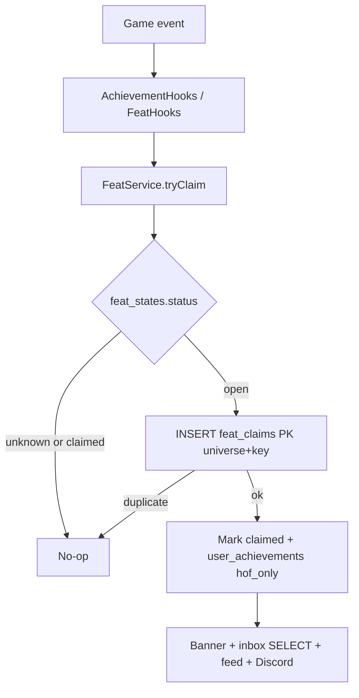
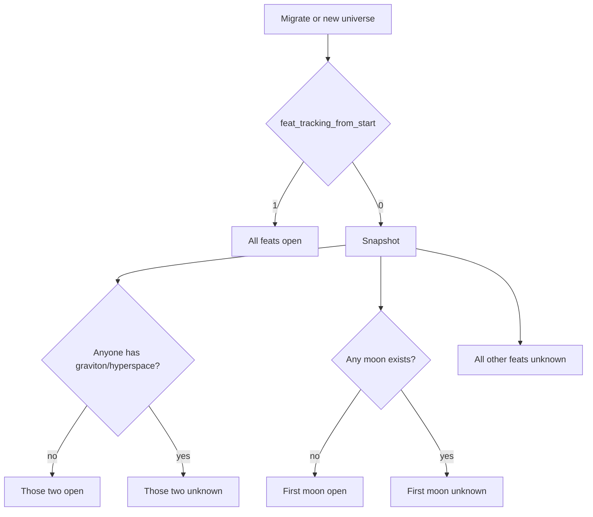

# feat: Per-universe feats of strength

## Summary

Add per-universe firsts (feats of strength) with one winner each. Claims write a Hall of Fame tab on the existing battle-hall page, set an overview banner, inbox every player in that universe, post the universe feed, and fire a per-universe Discord webhook. Prestige only. Existing universes never get fake opening-day firsts.

## Problem Frame

Hardcore players asked for universe firsts they can point at. Operators write those by hand today. Records track current maxes, not firsts. Achievements are personal thresholds, including First Blood as *your* first win. (see origin: `docs/brainstorms/2026-08-22-feats-of-strength-requirements.md`)

## Requirements

Origin R1–R18 remain in force, including the catalog expanded during planning. Planning pins the deferred bars below.

**Catalog** (origin R1–R5)

- R1. One winner per feat per universe for: first ship, first colony, first expedition, first graviton, first hyperspace tech, first moon, first to give a moon, first moon destruction, first deathstar, lose a deathstar in battle, defeat a deathstar, raider overcomes defenses, defender repulses 100+ ships, abandon a planet, abandon a homeworld.
- R2. First ship is the first *completed* shipyard unit, not a queued job.
- R3. Graviton is tech 199. Hyperspace Technology is tech 114.
- R4. Raider feat: attacker win and the defender had at least one defense unit before the fight. Defender feat: defender win and the attacking fleet's ship count (sum of hulls, not solar satellites) is at least 100. Give-a-moon: attacker whose combat calls `PlayerUtil::createMoon` on a planet they do not own.
- R5. Personal achievements, including First Blood, stay separate.

**Eligibility** (origin R6–R10)

- R6. Event-only firsts (ship, colony, expedition, give moon, moon destruction, lose/defeat deathstar, raid defenses, defend 100 ships, abandon planet, abandon home) only race if `feat_tracking_from_start` is on for that universe.
- R7. State-gated firsts only race if a migrate/install snapshot can prove they have not happened. Otherwise unknown. Never crown "next after deploy" as a fake first.
- R8. Snapshot rules for a live universe (`feat_tracking_from_start` = 0): graviton/hyperspace open iff no user has that tech; first moon open iff no `planet_type = 3` row exists; every other feat is unknown.
- R9. New universes created after this ships set `feat_tracking_from_start` = 1 and start every feat as unclaimed/open. Fresh install does the same.
- R10. At most one winner. Concurrent claims: the first successful unique insert wins. Same-second completions do not co-announce.

**Hall, surface, shout** (origin R11–R18)

- R11. Existing in-game Hall of Fame page (`game.php?page=battleHall`) gains a Feats of Strength tab. Same menu item. Battles stay on the default tab. No new nav. Not the public login Battle Hall. Not Records.
- R12. Hall lists every v1 feat as won (player + time), unclaimed, or unknown.
- R13. Feats do not appear on the Achievements page, grant no points, grant no rewards, and do not fire the personal achievement celebration overlay.
- R14. A valid claim sets the universe overview banner, inboxes every player in that universe, posts the universe feed, and posts Discord when a webhook is configured.
- R15. A missing Discord webhook does not block hall, banner, inbox, or feed.
- R16. Operators set the Discord webhook URL per universe in universe config. Validate with the existing Discord URL normalizer.
- R17. Do not announce unknown or ineligible events.

Origin actors A1–A3, flows F1–F4, and AE1–AE6 remain in force (AE4 uses the raider-vs-defense rule).

## Key Technical Decisions

- **FeatService owns claim and shout; achievement rows are the catalog.** Each feat is an achievement definition (`hof_only`, `points = 0`, `reward_type = none`) so admin and hooks stay in one catalog. Uniqueness lives in `%%FEAT_CLAIMS%%` with primary key `(universe, feat_key)`, not in `user_achievements` (that PK is per-user). The winner still gets a `user_achievements` row so the definition stays consistent; `getAchievementsForUser` excludes `hof_only`. (origin: universe-unique achievements, HoF-only surface)

- **Eligibility is snapshotted once, not inferred on every event.** Migration writes `feat_states` (`unknown` / `open` / later `claimed`). Live-universe proofs that we cannot make (no complete deathstar or moon-kill history) stay `unknown`. `log_shipyard` is queue time, not completion, and is not proof.

- **Start-of-tracking is a per-universe config flag.** Existing config rows migrate to `feat_tracking_from_start = 0`. New universes and fresh install use `1`. Do not use "universe age" heuristics.

- **Extend combat and moon hooks with payload; do not parse battle reports later.** `AchievementHooks::afterCombat` today only gets win/loss. Pass defender-had-defense, attacker ship count, deathstars lost per side. Moon form already happens in `MissionCaseAttack` via `PlayerUtil::createMoon` — hook both the owner (first moon) and the attacker (give moon).

- **Abandon hooks live on the overview abandon path, not `PlayerUtil::deletePlanet`.** `deletePlanet` refuses homeworlds (`id NOT IN (SELECT id_planet FROM users)`). Player abandon is `ShowOverviewPage` (`destruyed` delay, optional home reassignment). Combat moon-kill stays `MissionCaseDestruction` + `deletePlanet`.

- **Four shout channels, fail-open Discord.** Banner is config fields on that universe (`feat_banner_key`, `feat_banner_user_id`, `feat_banner_at`), shown on overview, replaced by the next claim. Inbox is one bulk `INSERT … SELECT` into `%%MESSAGES%%` for that universe. Feed adds `EVENT_FEAT` on `EventFirehoseWriter`. Discord reuses `DiscordWebhookService` posting and `normalizeUrl`, with a new per-universe URL (not the alliance combat webhook).

- **No personal achievement PM on feat unlock.** Skip `AchievementService::notifyUnlock` / celebration for `hof_only` rows. The universe shout is the message.

## High-Level Technical Design

Element IDs: hyperspace `114` (`LeftoverBonus::CARGO_TECH_ID`), graviton `199`, deathstar `214`.

## Implementation Units

### U1. Schema, config, seed, snapshot

- **Goal:** Persist feat catalog, per-universe tracking flag, webhook, banner fields, and initial `unknown`/`open` states.
- **Requirements:** R1, R6–R9, R16
- **Dependencies:** none
- **Files:** `install/migrations/migration_32.sql`, `install/install.sql`, `includes/dbtables.php`, `includes/classes/Config.php` (only if a new key must be global — webhook/banner/flag are per-universe columns, not `$globalConfigKeys`), `tests/Unit/FeatSnapshotTest.php`
- **Approach:** Add `feat_tracking_from_start`, `discord_feat_webhook`, `feat_banner_key`, `feat_banner_user_id`, `feat_banner_at` on `%%CONFIG%%`. Add `%%FEAT_STATES%%` (`universe`, `feat_key`, `status`, `winner_id`, `claimed_at`) and `%%FEAT_CLAIMS%%` (`universe`, `feat_key`, `user_id`, `claimed_at`) with PK `(universe, feat_key)`. Add `hof_only` tinyint on `%%ACHIEVEMENTS%%`. Seed one `hof_only` achievement per feat key per universe (`points` 0, `reward_type` none, `hidden` 0). PHP snapshot implements R8. Bump `DB_VERSION_REQUIRED` to 32. Fresh install: `feat_tracking_from_start = 1` and all feats open.
- **Patterns to follow:** `install/migrations/migration_29.sql` (config columns), `install/migrations/migration_20.php` (PHP migration), `install/migrations/migration_21.sql` (achievement seed).
- **Test scenarios:**
  - Existing universe row after migrate has `feat_tracking_from_start = 0`; graviton open only when no user has tech 199.
  - Existing universe with any moon marks first moon unknown.
  - Existing universe marks first ship unknown.
  - Fresh-install / new-universe path would leave all feats open (unit-test the snapshot helper with the flag on).
- **Verification:** `migrate.php status` shows 30; snapshot matches R8 on a fixture universe.

### U2. FeatService claim path

- **Goal:** Atomic try-claim: honor state, insert unique winner, unlock `hof_only` achievement without reward or celebration.
- **Requirements:** R10, R13, R17
- **Dependencies:** U1
- **Files:** `includes/classes/FeatService.php`, `includes/classes/AchievementService.php` (skip notify/celebrate/list for `hof_only`), `includes/classes/AchievementHooks.php` (thin forward), `tests/Unit/FeatServiceTest.php`, `tests/Support/FakeAchievementDatabase.php` as needed
- **Approach:** `tryClaim(universe, featKey, userId, at): bool`. If state is not `open`, return false. `INSERT` into `feat_claims`; on duplicate, return false. Update `feat_states` to `claimed`. Unlock the matching achievement with `celebrate = false` and no personal PM. Never throw to callers (combat/build must fail-open).
- **Execution note:** Implement claim uniqueness test-first.
- **Patterns to follow:** `AchievementService::unlock` / `isUnlocked`; fail-open style of `EventFirehoseWriter` and `DiscordWebhookService`.
- **Test scenarios:**
  - Covers AE5. Two claims for the same feat: only the first insert wins; second is silent.
  - Claim on `unknown` or already `claimed` does not write claims, messages, or unlocks.
  - Winner has `user_achievements` row; `getAchievementsForUser` does not return `hof_only` keys. Covers AE6 (no points, no payout).
  - `tryClaim` does not throw if Discord/feed later fails (broadcast is U4; claim must still persist).
- **Verification:** Unit tests cover unique insert and `hof_only` exclusion.

### U3. Event hooks

- **Goal:** Fire the right feat key from existing game events.
- **Requirements:** R1–R4, R6
- **Dependencies:** U2
- **Files:** `includes/classes/AchievementHooks.php`, `includes/classes/ResourceUpdate.php` (already calls `afterBuildCompleted`), `includes/classes/missions/MissionCaseAttack.php`, `includes/classes/missions/MissionCaseDestruction.php`, `includes/classes/missions/MissionCaseColonisation.php`, `includes/classes/missions/MissionCaseExpedition.php`, `includes/classes/PlayerUtil.php` (`createMoon`), `includes/pages/game/ShowOverviewPage.php` (abandon), `tests/Unit/FeatHooksTest.php`
- **Approach:** Map events to keys (directional, not signatures):
  - Build completed: any `reslist['fleet']` unit → `feat_first_ship`; element 214 → `feat_first_deathstar`; 199 → `feat_first_graviton`; 114 → `feat_first_hyperspace`.
  - Colonisation → `feat_first_colony`. Expedition return (existing `afterExpedition`) → `feat_first_expedition`.
  - Combat: attacker win + defender defenses > 0 → `feat_raid_defenses`; defender win + attacker ship count ≥ 100 → `feat_defend_100_ships`; own 214 lost → `feat_lose_deathstar`; enemy 214 destroyed → `feat_defeat_deathstar`.
  - `createMoon`: owner → `feat_first_moon`; if attacker id ≠ owner → `feat_give_moon`.
  - Destruction mission moon success → `feat_moon_destruction`.
  - Overview abandon of a non-home planet → `feat_abandon_planet`; abandon where `USER['id_planet'] == PLANET['id']` before reassignment → `feat_abandon_home`.
- **Patterns to follow:** Existing `AchievementHooks` thin wrappers; keep mission classes free of claim logic.
- **Test scenarios:**
  - Covers AE4. Attacker win vs zero defense does not claim raider feat.
  - Attacker win vs missile/turret count > 0 claims raider when state is open.
  - Defender win vs 99 ships does not claim; 100 ships does.
  - Build completion of a ship claims first ship only when state is open (live uni unknown stays unknown). Covers AE1 analog.
  - Moon created for the defender: defender can claim first moon, attacker can claim give-moon.
  - Abandon homeworld (has another planet) claims `feat_abandon_home`, not only `feat_abandon_planet`.
- **Verification:** Hook unit tests with combat/build fixtures; no claim when state is unknown.

### U4. Banner, inbox, feed, Discord

- **Goal:** On successful claim, shout on all four channels; Discord optional and fail-open.
- **Requirements:** R14–R17
- **Dependencies:** U2
- **Files:** `includes/classes/FeatService.php` (orchestrate), `includes/classes/EventFirehoseWriter.php`, `includes/classes/DiscordWebhookService.php`, `includes/pages/game/ShowOverviewPage.php`, `styles/templates/game/page.overview.default.tpl`, `includes/pages/adm/ShowConfigUniPage.php`, `styles/templates/adm/ShowConfigUniPage.tpl` (or current admin uni config tpl), `tests/Unit/FeatBroadcastTest.php`, `tests/Unit/DiscordHostileNotifyTest.php` pattern for URL tests
- **Approach:** After claim: write banner config fields; bulk insert messages for `%%USERS%%.universe`; `EventFirehoseWriter` new `EVENT_FEAT` (size/outcome can be unused placeholders or a dedicated outcome `claimed`); `notifyFeatClaimed` posts an embed using `normalizeUrl` on `config->discord_feat_webhook`. Admin field mirrors alliance webhook (paste URL, optional clear checkbox). Do not log the URL.
- **Patterns to follow:** `DiscordWebhookService` timeouts, allow-list hosts, `setPoster` for tests; `EventFirehoseWriter::insert` try/catch.
- **Test scenarios:**
  - Covers AE6. Claim with empty webhook still writes banner, inbox rows, and feed.
  - Invalid webhook saved in admin is rejected; other uni settings still save (same behavior as alliance webhook).
  - Inbox insert targets only that universe.
  - Next claim replaces banner fields.
  - Discord poster exception does not roll back the claim.
- **Verification:** Broadcast unit tests plus overview assigns banner when fields are set.

### U5. Hall of Fame tab

- **Goal:** Players browse firsts on the existing Hall of Fame page.
- **Requirements:** R11, R12, F4
- **Dependencies:** U1, U2
- **Files:** `includes/pages/game/ShowBattleHallPage.php`, `styles/templates/game/page.battleHall.default.tpl`, `language/*/INGAME.php`, `tests/Unit/ShowBattleHallFeatsTest.php` if pages are unit-testable; otherwise a focused integration/smoke path
- **Approach:** Query param tab (`battles` default, `feats`). Feats tab lists origin catalog order with winner name, time, or unknown/unclaimed labels. Battles query unchanged. Public `includes/pages/login/ShowBattleHallPage.php` untouched.
- **Patterns to follow:** Current `ShowBattleHallPage` universe filter; table layout of `page.battleHall.default.tpl`.
- **Test scenarios:**
  - Default tab still returns top-100 battles for the current universe.
  - Feats tab shows unknown for a start-gated feat on a live snapshot, unclaimed for an open graviton, winner+time after claim.
  - Login battle hall page has no feats tab.
- **Verification:** In-game HoF has both tabs; login HoF unchanged.

### U6. Languages and new-universe flag

- **Goal:** Every language file has the new keys; newly created universes arm opening-day firsts.
- **Requirements:** R9, R11, R14
- **Dependencies:** U1, U5
- **Files:** `language/*/INGAME.php`, `language/*/ACHIEVEMENTS.php` (feat name/desc keys), `language/*/ADMIN.php`, universe-create path (`includes/pages/adm/ShowUniversePage.php` or equivalent), `install/install.sql`
- **Approach:** English strings first; copy keys to all locales (CI language check). New universe insert sets `feat_tracking_from_start = 1`, seeds the same `hof_only` achievement rows as install (one per feat key), and inserts `feat_states` as all `open`. Do not copy claimed winners from another universe.
- **Patterns to follow:** Existing `ach_*` name/desc keys; language-check script in CI.
- **Test scenarios:**
  - Creating a second universe in a test install yields `feat_tracking_from_start = 1` and open first-ship.
  - Language-check script is happy (all keys present).
- **Verification:** `php .github/scripts/check-language-files.php` passes; new uni is race-ready.

## Scope Boundaries

**Deferred for later** (from origin)

- Chronicle of first-ever for every ship class / building / tech
- Historical backfill of winners
- Public login-site listing
- Titles, badges, points, gameplay rewards
- Extra feats beyond origin R1

**Outside this product** (from origin)

- Replacing Records or the top-100 battle hall
- Turning personal achievements into a first-to-X ladder

**Deferred to follow-up work**

- Rate-limiting Discord if many firsts fire in one minute on a brand-new universe (fail-open posts are enough for v1)
- Player-dismissable banner vs replace-on-next-claim (v1 replaces)

## Risks & Dependencies

- **False firsts on live unis.** Mitigated by snapshot + `feat_tracking_from_start`. Do not "open" deathstar because nobody currently owns one.
- **Combat hook payload.** If `afterCombat` is not extended, raider/defender/DS feats cannot be judged. U3 must change the hook signature and both current call sites (`MissionCaseAttack`, `MissionCaseDestruction`). ACS uses the attack mission class.
- **Inbox volume.** Bulk insert one row per user per claim. Acceptable at current population; keep it one SQL statement, not a PHP loop of `sendMessage`.
- **Webhook secrets.** Store like `ally_discord_webhook`; never echo back in full if the alliance UI already redacts — match that pattern.
- **Homeworld abandon is rare and destructive.** Still in catalog because it was requested; eligibility unknown on live unis.

## Operational / Rollout Notes

- Run `php migrate.php run` (version 32). Existing universes show most feats as unknown; graviton/hyperspace/first-moon only if the snapshot says open.
- Operators paste the Discord webhook on the universe config page before they care about shouts. In-game hall works without it.
- Creating a new universe after migrate is the way to get opening-day races (first ship, first colony, …).

## Open Questions

None blocking. Banner duration is replace-on-next-claim (origin deferred; pinned here). Expedition is completed mission, not send.

## Sources

- Origin: `docs/brainstorms/2026-08-22-feats-of-strength-requirements.md`
- Achievements: `includes/classes/AchievementService.php`, `includes/classes/AchievementHooks.php`, `tests/Integration/AchievementServiceIntegrationTest.php`
- Hall of Fame: `includes/pages/game/ShowBattleHallPage.php`, `styles/templates/game/page.battleHall.default.tpl`
- Feed: `includes/classes/EventFirehoseWriter.php`
- Discord: `includes/classes/DiscordWebhookService.php` (alliance URL only today)
- Moon form: `includes/classes/missions/MissionCaseAttack.php` (`PlayerUtil::createMoon`)
- Moon kill: `includes/classes/missions/MissionCaseDestruction.php`
- Abandon: `includes/pages/game/ShowOverviewPage.php`; `PlayerUtil::deletePlanet` cannot delete homeworlds
- Hyperspace id: `includes/classes/LeftoverBonus.php` (`CARGO_TECH_ID = 114`)
- Shipyard completion: `includes/classes/ResourceUpdate.php` → `afterBuildCompleted` (not `log_shipyard.queued_at`)
