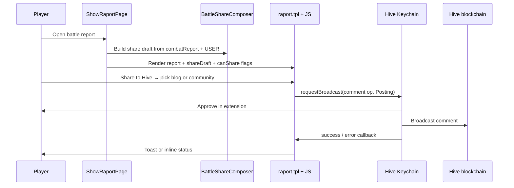

# feat: Share battle to Hive

**Created:** 2026-08-26  
**Origin:** ce-brainstorm session (player-driven Hive discovery; no requirements doc written)  
**Implementation worktree:** `.worktrees/feat/hive-battle-share` on branch `feat/hive-battle-share`

---

## Summary

Add a **Share to Hive** action on in-game battle reports so Hive-linked players publish a short battle highlight from their own account via Keychain, choosing **personal blog** or a **Hive community**, with an existing **referral invite link** in the post body to drive visits to moon.hive.pizza.

---

## Problem Frame

HiveNova already integrates Hive for auth, seasons, memos, and automated season logs, but discovery for Hive-native gamers depends on players manually recruiting on-chain. The growth bottleneck is **visibility**, not signup mechanics. Player-driven battle posts turn combat moments into shareable Hive content without building a full social suite.

---

## Requirements

| ID | Requirement |
|----|-------------|
| R1 | A Hive-linked player viewing their battle report can open a **Share to Hive** action. |
| R2 | The post is published from the **player's Hive account** via Keychain (`Posting` authority); the game never stores or uses the player's posting key. |
| R3 | Before publish, the player chooses **personal blog** or **Hive community** as the destination. |
| R4 | The post body includes a concise battle summary (attacker/defender, result, key stats) and a **Play Moon** CTA link. |
| R5 | The CTA reuses the existing referral URL pattern (`index.php?ref={userId}`) when referrals are active; otherwise links to the public landing URL. |
| R6 | Share is unavailable when Keychain is missing, the player has no linked `hive_account`, or the report cannot be summarized safely. |
| R7 | Success and failure feedback is shown in the battle-report UI without breaking the report view. |
| R8 | Automated battle spam, empire/profile share, alliance posts, and referral payouts remain out of scope. |

---

## Key Technical Decisions

| Decision | Rationale |
|----------|-----------|
| **Server composes draft; client broadcasts** | PHP builds title/body/permlink/tags from the combat report (testable, consistent markdown). JS only calls Keychain — mirrors existing sign/send flows in `scripts/game/base.js`. |
| **`requestBroadcast` with `comment` op** | Keychain's `requestPost` has reported reliability issues; `requestBroadcast(account, [['comment', payload]], 'Posting', cb)` is the community-recommended path. |
| **Personal blog vs community via parent fields** | Root post: `parent_author=''`, `parent_permlink=<primary-tag>` (default `hivenova`). Community post: `parent_author=<community account>`, `parent_permlink=<community id>`. Player picks destination in UI. |
| **Reuse referral attribution, no new invite system** | `ref_active` + `?ref=` already attribute signups (`ShowIndexPage`, `ShowRegisterPage`, settings invite snippets). Do not add parallel tracking in v1. |
| **Permlink from report id + time** | Derive a unique slug from `raport` RID and battle timestamp to avoid collisions on repeat shares. |
| **`app` metadata tag `hivenova/battle-share`** | Distinguishes player shares from automated season posts (`hivenova/season`). |
| **Battle report popup only (v1)** | `ShowRaportPage::show()` is the authenticated participant view. Public Battle Hall replay sharing is deferred. |

---

## High-Level Technical Design

---

## Scope Boundaries

**In scope:** Share button on in-game battle report; Keychain publish; blog/community destination choice; referral CTA; EN strings + language-file parity.

**Deferred for later:**
- Battle Hall / public replay share
- Empire, profile, or alliance share actions
- Referral token rewards or payout changes
- Server-side visit analytics beyond existing `?ref=` signup attribution
- Auto-posting battles without player action

**Outside identity:** A general "Hive social hub" or feed aggregator inside HiveNova.

---

## Implementation Units

### U1. Battle share draft composer (PHP)

**Goal:** Produce a deterministic, testable Hive post draft from a combat report and player context.

**Requirements:** R4, R5, R6

**Dependencies:** None

**Files:**
- `includes/classes/BattleShareComposer.php` (new)
- `tests/Unit/BattleShareComposerTest.php` (new)

**Approach:**
- Accept combat report array, raport RID, player id/username, `hive_account`, `ref_active`, and base URL.
- Return structured draft: `title`, `body` (markdown), `permlink`, `tags`, `parent_author`, `parent_permlink` (defaults for blog), `json_metadata`, `canShare` + `reason` when blocked.
- Body template: one-line headline, VS line, result, units lost, debris/steal if present, CTA with referral link, footer credit line (`HiveNova` + link).
- Validate `hive_account` with existing `HiveUtil::isAccountValid`.
- Sanitize/strip HTML from report-derived strings; cap body length (e.g. 8 KB) to stay within Hive limits.

**Patterns to follow:** `HiveCommentPoster` tag/metadata conventions; `SeasonReportComposer` markdown tone.

**Test scenarios:**
- Happy path: attacker win report → draft with correct result text and referral URL when `ref_active=1`.
- Referrals off: CTA uses landing URL without `?ref=`.
- Missing hive account: `canShare=false`.
- Draw and defender-win variants produce correct result strings.
- Permlink uniqueness: same RID different timestamps differ.
- Community override: passing community author/permlink replaces blog defaults.

**Verification:** Unit tests pass; draft fields match expected markdown for fixture reports.

---

### U2. Wire share context into battle report page

**Goal:** Expose composer output to the battle report template for eligible viewers.

**Requirements:** R1, R6

**Dependencies:** U1

**Files:**
- `includes/pages/game/ShowRaportPage.php`
- `includes/classes/class.BattleShareComposer.php` autoload path (PSR-4 already under `includes/classes/`)

**Approach:**
- In `show()` only (authenticated participant view), after combat report is loaded and normalized, call `BattleShareComposer`.
- Pass `USER['hive_account']`, `USER['id']`, universe config `ref_active`, and `HTTP_PATH` / self URL helper used elsewhere.
- Assign template vars: `shareDraft`, `canShareToHive`, `shareBlockReason`, `hiveAccount`, `suggestedCommunities` (small curated list — e.g. primary tag `hivenova` plus 1–2 gaming communities as constants in composer or `includes/constants.php`).

**Patterns to follow:** `ShowSettingsPage` referral snippet vars (`ref_active`, `userid`).

**Test scenarios:**
- Integration-level: extend existing raport page tests if present, or unit-test composer invocation from a thin wrapper.
- Non-participant / missing report: share vars absent or `canShare=false`.

**Verification:** Opening a battle report as a linked Hive participant exposes share draft JSON in page source.

---

### U3. Battle report UI — share button and destination picker

**Goal:** Let the player choose blog vs community and confirm before Keychain opens.

**Requirements:** R1, R3, R7

**Dependencies:** U2

**Files:**
- `styles/templates/game/shared.mission.raport.tpl`
- `styles/resource/css/ingame/main.css` (minimal button/modal styles if needed)

**Approach:**
- Add **Share to Hive** button in report header/summary when `canShareToHive`.
- Modal or inline panel:
  - Radio: **My blog** vs **Community**
  - Community mode: select from `suggestedCommunities` + optional text field for custom community id (validate non-empty before submit)
  - Preview collapsed title/first lines of draft (optional, keep minimal)
  - Confirm → calls JS share function
- Disabled state + tooltip when Keychain not detected (mirror settings Keychain messaging).
- Hide entirely when `canShareToHive` is false.

**Patterns to follow:** Existing modal/button patterns in ingame CSS; Keychain button styling from login templates where appropriate.

**Test scenarios:**
- Manual: linked account + Keychain → modal flow completes.
- Manual: no Keychain → friendly message, no crash.

**Verification:** UI visible only for eligible users; destination choice reflected in broadcast payload.

---

### U4. Keychain broadcast client helper

**Goal:** Publish the server-prepared draft through Hive Keychain.

**Requirements:** R2, R7

**Dependencies:** U3

**Files:**
- `scripts/game/base.js` (extend) or `scripts/game/battle-share.js` (new, included from template)

**Approach:**
- Add `HiveKeychainShareBattle(draft, destination)`:
  - Guard `typeof hive_keychain === 'undefined'`.
  - Apply destination: blog uses draft defaults; community sets `parent_author` / `parent_permlink` from picker.
  - Build `comment` operation object matching Hive API field order used elsewhere.
  - `json_metadata` as stringified JSON from draft.
  - Call `hive_keychain.requestBroadcast(hiveAccount, [['comment', comment]], 'Posting', callback)`.
  - Map Keychain response to user-visible success/error (reuse existing notice patterns if any).

**Patterns to follow:** `HiveKeychainLogin()`, `HiveSendToken()` error handling in `scripts/game/base.js`.

**Test scenarios:**
- Manual Keychain approve/decline paths.
- Community vs blog parent fields differ in constructed op.

**Verification:** Successful broadcast returns tx id in callback; user sees confirmation.

---

### U5. Language strings

**Goal:** User-facing copy for share flow in all supported languages.

**Requirements:** R7

**Dependencies:** U3

**Files:**
- `language/en/INGAME.php` (and FLEET if battle strings live there)
- `language/{de,es,fr,pl,pt,ru,tr}/INGAME.php`

**Approach:**
- Add keys: share button label, modal title, blog/community labels, Keychain missing message, success/failure toasts, CTA label text, community picker hint.
- Run `php .github/scripts/check-language-files.php` before PR.

**Test scenarios:** Language check script passes.

**Verification:** EN strings present; all locales have matching keys.

---

## Risks & Dependencies

| Risk | Mitigation |
|------|------------|
| Keychain not loaded on popup pages | Document requirement; detect and message; optional future: inject Keychain discovery script in `main.header.tpl` for popup bodyclass. |
| Community id entered incorrectly | Suggest curated list; validate format; show Hive error on failed broadcast. |
| Spam perception if share is one-click | Keep modal confirm step; no auto-post; player writes nothing but must approve Keychain. |
| Referral link measures signups, not raw visits | Accept for v1 per brainstorm success metric; note in release notes. |
| Popup window lacks Keychain on some browsers | Test Chrome/Firefox with extension; fallback message. |

**Dependencies:** Hive Keychain browser extension; existing `hive_account` link flow; `ref_active` config.

---

## Open Questions

1. **Default suggested communities** — start with tag `hivenova` as blog default; confirm 1–2 community accounts for the picker (e.g. Hive Pizza gaming community) before ship.
2. **Share eligibility** — v1: any battle participant with linked Hive account who can view the report. Restrict to wins only? (Default: all results — player decides what's worth sharing.)

---

## Verification (feature-level)

- Linked player opens battle report → Share to Hive visible.
- Publish to personal blog → post appears on player's Hive blog with CTA link containing `?ref=` when referrals active.
- Publish to selected community → post appears under that community.
- Player without linked Hive account → no share button.
- Keychain absent → clear error, report still usable.
- `./tests/run-ci-local.sh` passes including new unit tests and language check.

---

## Worktree note

Implement on branch **`feat/hive-battle-share`** in worktree **`.worktrees/feat/hive-battle-share`** to keep the main checkout clean. Open PR to `develop` (not `master`) per project convention.
